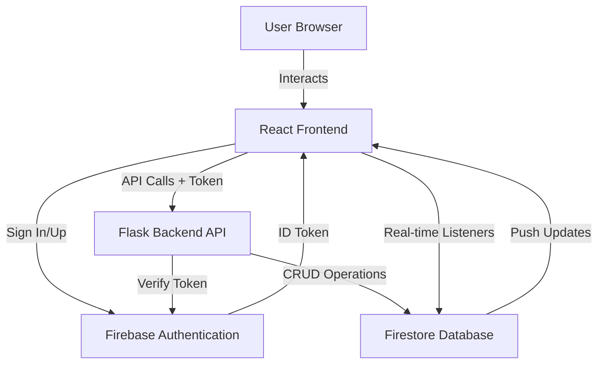

# CollaboCal: Community Action Planner - Architecture & Implementation Plan

## 🎯 Project Overview

CollaboCal is a hyper-local, collaborative platform for organizing community-driven events. Users can create "Action Cards" for neighborhood activities, and collaboratively plan them using real-time shared tools.

**Tech Stack:**
- **Frontend:** React with modern hooks and Context API
- **Backend:** Flask (Python) with RESTful API
- **Database & Real-time:** Firebase (Firestore + Authentication)
- **Maps:** Leaflet or Google Maps API
- **Geospatial:** Geohashing for location queries

---

## 🏗️ System Architecture



**Data Flow:**
1. User authenticates via Firebase Authentication SDK
2. Firebase returns ID Token to React app
3. React sends API requests to Flask with ID Token in Authorization header
4. Flask verifies token using Firebase Admin SDK
5. Flask performs business logic and updates Firestore
6. React subscribes directly to Firestore for real-time updates
7. Firestore pushes changes to all subscribed clients instantly

---

## 📊 Database Schema (Firestore)

### Collections Structure

```
firestore/
├── users/
│   └── {userId}
│       ├── uid: string
│       ├── displayName: string
│       ├── email: string
│       ├── photoURL: string
│       └── lastKnownLocation: GeoPoint
│
├── actions/
    └── {actionId}
        ├── title: string
        ├── description: string
        ├── createdAt: timestamp
        ├── eventDate: timestamp
        ├── creatorUid: string
        ├── locationName: string
        ├── location: GeoPoint
        ├── geohash: string
        │
        ├── participants/ (subcollection)
        │   └── {userId}
        │       ├── uid: string
        │       ├── displayName: string
        │       └── joinedAt: timestamp
        │
        ├── checklistItems/ (subcollection)
        │   └── {itemId}
        │       ├── text: string
        │       ├── isCompleted: boolean
        │       ├── completedBy: string (uid)
        │       ├── createdAt: timestamp
        │       └── order: number
        │
        └── chatMessages/ (subcollection)
            └── {messageId}
                ├── text: string
                ├── senderUid: string
                ├── senderName: string
                ├── timestamp: timestamp
                └── photoURL: string
```

### Firestore Security Rules

```javascript
rules_version = '2';
service cloud.firestore {
  match /databases/{database}/documents {
    match /users/{userId} {
      allow read: if request.auth != null;
      allow write: if request.auth.uid == userId;
    }
    
    match /actions/{actionId} {
      allow read: if request.auth != null;
      allow create: if request.auth != null;
      allow update: if request.auth.uid == resource.data.creatorUid;
      allow delete: if request.auth.uid == resource.data.creatorUid;
      
      match /participants/{userId} {
        allow read: if request.auth != null;
        allow write: if request.auth.uid == userId;
      }
      
      match /checklistItems/{itemId} {
        allow read: if request.auth != null;
        allow write: if request.auth != null && 
                       exists(/databases/$(database)/documents/actions/$(actionId)/participants/$(request.auth.uid));
      }
      
      match /chatMessages/{messageId} {
        allow read: if request.auth != null;
        allow create: if request.auth != null && 
                        exists(/databases/$(database)/documents/actions/$(actionId)/participants/$(request.auth.uid));
      }
    }
  }
}
```

---

## 🎨 Project Structure

### Backend Structure

```
collabocal-backend/
├── app/
│   ├── __init__.py              
│   ├── config.py                
│   ├── middleware.py            
│   ├── routes/
│   │   ├── __init__.py
│   │   ├── actions.py          
│   │   └── users.py            
│   ├── services/
│   │   ├── __init__.py
│   │   ├── firebase_service.py 
│   │   └── geohash_service.py  
│   └── utils/
│       ├── __init__.py
│       └── validators.py        
├── tests/
├── .env.example
├── requirements.txt
└── run.py                       
```

### Frontend Structure

```
collabocal-frontend/
├── src/
│   ├── components/
│   │   ├── common/
│   │   ├── action/
│   │   ├── dashboard/
│   │   └── map/
│   ├── pages/
│   ├── contexts/
│   ├── firebase/
│   ├── hooks/
│   ├── services/
│   └── utils/
├── .env.example
└── package.json
```

---

## 📋 Implementation Phases

### Phase 1: MVP (Minimum Viable Product)

**Goal:** Build core functionality for creating and viewing community actions.

#### 1.1 Project Setup & Configuration
- Set up backend and frontend project structure
- Install dependencies
- Configure environment variables
- Initialize Firebase

#### 1.2 Backend - Flask API Foundation
- Create Flask app with CORS
- Implement authentication middleware
- Set up Firebase Admin SDK
- Create health check endpoint

#### 1.3 Frontend - React App Foundation
- Initialize React app
- Set up routing
- Create authentication context
- Build API service layer

#### 1.4 Firebase Integration - Authentication
- Implement Google OAuth
- Implement email/password auth
- Create user profiles in Firestore
- Build login/signup UI

#### 1.5 Basic Action CRUD Operations
- Create action endpoint and UI
- List actions endpoint and UI
- View action details
- Edit/delete actions (creator only)
- Join action functionality

#### 1.6 Simple Map Integration
- Integrate Leaflet maps
- Display actions on map
- Location picker for creating actions
- Basic marker interactions

#### 1.7 MVP Testing & Validation
- End-to-end testing
- Bug fixes
- Performance baseline
- User acceptance

---

### Phase 2: Real-time Collaboration

**Goal:** Add real-time features for team collaboration.

#### 2.1 Real-time Firestore Listeners
- Create custom Firestore hooks
- Implement subscription management
- Handle real-time errors
- Build action dashboard

#### 2.2 Shared Checklist Implementation
- Display checklist with real-time updates
- Add/remove checklist items
- Toggle item completion
- Show who completed items

#### 2.3 Real-time Chat Implementation
- Message display with auto-scroll
- Send messages
- Show timestamps and avatars
- Handle message formatting

#### 2.4 Participant Management
- Display participant list
- Enhanced join/leave logic
- Participant notifications
- Avatar stack UI

---

### Phase 3: Advanced Features

**Goal:** Add location-based discovery and optimization.

#### 3.1 Geospatial Queries with Geohashing
- Implement geohashing service
- Create nearby actions endpoint
- Add geohash to action creation
- Build location-based filtering

#### 3.2 Advanced Map Features
- Marker clustering
- Map filters
- Custom markers by type
- Location search

#### 3.3 User Location Services
- Save user location preferences
- Location permissions handling
- Default map center
- Radius preferences

#### 3.4 Performance Optimization
- Backend caching
- Rate limiting
- Frontend code splitting
- Query optimization
- Virtual scrolling

---

### Final Phase: Deployment

**Goal:** Deploy production-ready application.

- Deploy backend to Heroku/Railway
- Deploy frontend to Vercel/Netlify
- Configure production environment
- Set up monitoring
- Write documentation
- Create demo data

---

## 🔑 Key Technical Implementations

### Authentication Flow

```javascript
// React - Get ID Token
const user = auth.currentUser;
const token = await user.getIdToken();

// React - API Call with Token
const response = await api.post('/actions', data, {
  headers: { Authorization: `Bearer ${token}` }
});

// Flask - Verify Token
from firebase_admin import auth

decoded_token = auth.verify_id_token(id_token)
user_id = decoded_token['uid']
```

### Real-time Updates

```javascript
// React - Subscribe to Firestore
useEffect(() => {
  const unsubscribe = onSnapshot(
    collection(db, 'actions', actionId, 'chatMessages'),
    snapshot => {
      const messages = snapshot.docs.map(doc => ({
        id: doc.id,
        ...doc.data()
      }));
      setMessages(messages);
    }
  );
  
  return () => unsubscribe();
}, [actionId]);
```

### Geospatial Queries

```python
# Flask - Find Nearby Actions
import pygeohash as pgh

def get_nearby_actions(lat, lng, radius_km=5):
    geohash = pgh.encode(lat, lng, precision=5)
    
    actions = db.collection('actions')\
        .where('geohash', '>=', geohash)\
        .where('geohash', '<=', geohash + '~')\
        .stream()
    
    return [action for action in actions]
```

---

## 🔐 Security Checklist

- ✓ Firebase security rules configured
- ✓ Token verification on all protected endpoints
- ✓ CORS restricted to production domain
- ✓ Input validation and sanitization
- ✓ Rate limiting implemented
- ✓ Environment variables secured
- ✓ HTTPS enforced
- ✓ XSS protection

---

## 📈 Success Metrics

**Technical:**
- Real-time latency < 100ms
- API response < 200ms
- Lighthouse score > 90
- Zero critical vulnerabilities

**Features:**
- User authentication ✓
- CRUD operations ✓
- Real-time collaboration ✓
- Location-based discovery ✓
- Mobile responsive ✓

---

## 🚀 Getting Started

This architecture document serves as your implementation blueprint. Follow the phases sequentially, starting with Phase 1.1. Each phase builds upon the previous one, creating a solid foundation for the next set of features.

**Next Steps:**
1. Review this plan thoroughly
2. Clarify any questions or concerns
3. Prepare Firebase credentials
4. Switch to Code mode to begin implementation
5. Start with Phase 1.1: Project Setup

---

## 📚 Resources

- [Flask Documentation](https://flask.palletsprojects.com/)
- [React Documentation](https://react.dev/)
- [Firebase Documentation](https://firebase.google.com/docs)
- [Leaflet Documentation](https://leafletjs.com/)
- [Firestore Security Rules](https://firebase.google.com/docs/firestore/security/get-started)
- [Geohashing Explained](https://www.movable-type.co.uk/scripts/geohash.html)

---

*This architecture is designed to showcase full-stack development skills while building a practical, real-world application.*